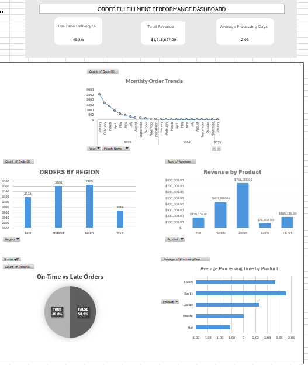

# Order Fulfillment Performance Dashboard

This project analyzes 25,000+ e-commerce orders across multiple regions and product categories to uncover operational bottlenecks, delivery delays, revenue drivers, and processing inefficiencies.  
The dashboard was built using **Excel, Power Query, PivotTables, and SQL** as part of a complete end-to-end analytics workflow.

---

## Dashboard Preview

---

## Key Insights

- **On-time delivery rate is 49.8%**, indicating significant fulfillment or logistics inefficiencies.  
- **Monthly order volume drops sharply**, then stabilizes, suggesting demand changes or operational slowdowns.  
- The **Midwest and South** regions generate the highest order volume.  
- **Jackets drive the most revenue** at ~$751k, making them a critical product for inventory and forecasting.  
- **Socks have the slowest processing time (~2.07 days)**, indicating a category-specific bottleneck.  
- Average processing time across all products is approximately **2 days**, contributing to late deliveries.

These insights helped guide actionable recommendations around inventory planning, workflow optimization, and regional prioritization.

---

## SQL Analysis

Before building the dashboard, I used SQL to explore, validate, and summarize the dataset.  
This ensured the Excel calculations and KPIs aligned with accurate backend logic.

The order_fulfillment_analysis.sql script includes:

### Core Metrics
- Total order volume by region  
- Revenue breakdown by product  
- On-time vs late shipment counts  
- Average processing and delivery times  

### Operational Performance Checks
- Identifying slow-processing products  
- Comparing shipped vs canceled orders  
- Delivery time distribution and bottlenecks  

### SQL Purpose
Using SQL allowed me to:
- confirm the accuracy of Excel pivot aggregations  
- inspect data quality  
- validate fulfillment performance  
- understand product-level and regional patterns before visualization  

---

## Tools & Techniques Used

### **Excel**
- Power Query for data cleaning  
- PivotTables for summarization  
- KPI card design  
- Custom layouts and professional formatting  
- Multi-chart dashboard structure  

### **SQL (SQLite)**
- Aggregations (SUM, AVG, COUNT)  
- GROUP BY analysis  
- Filtering delivery status  
- Product and regional comparisons  
- Exported query script included in repository  

### **Data Skills**
- Data cleaning  
- Data modeling  
- Trend analysis  
- Fulfillment performance analysis  
- Visualization & storytelling  

---

